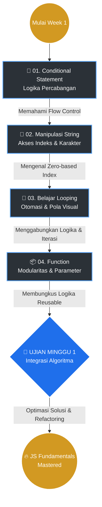

# 🚀 PHASE 0 • WEEK 1: JavaScript Fundamental Foundations

> 📂 **Halaman Indeks Utama (Portal Navigasi)**
> Selamat datang di basis pembelajaran JavaScript Dasar Minggu Pertama. Repositori ini tidak hanya sekadar kumpulan kode, melainkan sebuah **arsitektur pengetahuan** yang dirancang secara komprehensif. Tujuan utamanya adalah memudahkan pemahaman konteks, memetakan kurikulum, dan menghubungkan konsep-konsep abstrak menjadi implementasi logis.

---

## 🎯 Objektif Pembelajaran (Learning Goals)

Pada akhir minggu pertama ini, fokus utamanya bukan sekadar hafal sintaks, melainkan membangun fondasi *engineering*:
1. **Algorithmic Thinking**: Mampu memecahkan masalah besar menjadi langkah-langkah logis kecil.
2. **Data Manipulation**: Menguasai interaksi antar tipe data dasar (terutama *String* dan *Number*).
3. **Flow Control & Iteration**: Mengendalikan arah eksekusi program menggunakan `if/else`, `switch`, dan `looping`.
4. **Modularity**: Memahami esensi `function` untuk membuat kode yang *reusable* dan terisolasi dengan baik.

---

## 🗺️ Peta Kurikulum & Alur Berpikir

Alur pembelajaran dirancang sekuensial. Setiap materi adalah prasyarat untuk materi berikutnya.

---

## 📊 Dashboard Pembelajaran

| Indikator | Metrik | Keterangan Fokus |
| :--- | :---: | :--- |
| 📁 **Total Modul** | **2 Segmen** | Terbagi atas **QUIZ** (Pembelajaran Berkelanjutan) & **UJIAN** (Evaluasi Akhir). |
| 🧩 **Jumlah Challenge** | **18 Tantangan** | 14 Quiz pengenalan sintaks + 4 Ujian pengujian algoritma kompleks. |
| ⚡ **Skema Solusi** | **Multi-Version** | Didokumentasikan dari solusi primitif (*brute-force*) hingga *Ultimate One-Liner*. |
| 🎯 **Tingkat Kesulitan** | **Beginner ➜ Mid** | Dari deklarasi kondisi sederhana hingga manipulasi pola *nested-looping*. |

---

## 📂 Pemetaan Modul & Konteks

### 1. [📝 QUIZ — Pembelajaran Berkelanjutan](./QUIZ/)
Fase *muscle-memory*. Kumpulan kuis latihan modular untuk menguji pemahaman sintaksis dan implementasi logika per topik secara terisolasi.

| Sub-Topik | Konteks Pembelajaran (Apa & Mengapa) | Tantangan Unggulan |
|---|---|---|
| [🔀 01-Conditional](./QUIZ/01-Conditional-Statement/) | **Flow Control:** Mengatur program agar bisa "mengambil keputusan" berdasarkan kondisi `true`/`false`. | Game Proxytia, Format Bulan Switch |
| [🧩 02-Pre-Looping](./QUIZ/02-Quiz-Pemrograman-Sebelum-Masuk-Looping/) | **String as Array:** Memahami bahwa string bisa dipotong, dirangkai, dan diakses per karakternya. | Manual Indexing, `substring()` |
| [🔄 03-Looping](./QUIZ/03-Belajar-Looping/) | **Automation:** Melakukan tugas berulang tanpa duplikasi kode, dan menyusun pola visual 2D. | Odd/Even Loop, Pola Segitiga Bintang |
| [📦 04-Function](./QUIZ/04-Function/) | **Encapsulation:** Membungkus sekumpulan kode menjadi satu entitas utuh yang bisa dipanggil kapan saja. | Kalkulasi Perkalian, Pemrosesan Kalimat |

---

### 2. [🏆 UJIAN — Evaluasi & Optimasi](./UJIAN/)
Fase sintesis. Menggabungkan konsep dari modul Quiz untuk memecahkan masalah algoritma yang lebih kompleks. Mengutamakan **dokumentasi evolusi solusi** untuk melihat bagaimana kode berkembang menjadi lebih efisien.

| No | Challenge | Objektif Tantangan | Senjata Utama (Konsep) | Varian Solusi |
|:---:|---|---|---|:---:|
| 01 | [🔢 Bandingkan Angka](./UJIAN/01-Dokumentasi-compare-numbers_bandingkan-angka/) | Menentukan komparasi matematis antara dua input. | Boolean Evaluation, Ternary Operator | **4 Versi** |
| 02 | [🔄 Balik Kata](./UJIAN/02-Dokumentasi-string-reversal_balik-kata/) | Membalik urutan karakter secara presisi. | Reverse Iteration, Spread `[...]`, `split` | **3 Versi** |
| 03 | [⏱️ Konversi Menit](./UJIAN/03-Dokumentasi-convert-minutes_konversi-menit/) | Transformasi integer ke dalam format `jam:menit`. | Modulo `%`, `Math.floor()`, `.padStart()` | **3 Versi** |
| 04 | [⚖️ Perbandingan XO](./UJIAN/04-Dokumentasi-character-comparison_perbandingan-karakter-xo/) | Menghitung dan menyeimbangkan jumlah karakter spesifik. | Counter Mechanism, Early Return, Case Check | **4 Versi** |

---

## 🎯 Matriks Sintaksis (Concept-to-Challenge Matrix)
*Butuh referensi cepat cara menggunakan metode tertentu? Gunakan matriks ini untuk langsung melompat ke file contoh penggunaannya di dunia nyata.*

| Konsep / Sintaksis JavaScript | Diimplementasikan Pada | Kategori |
|---|---|:---:|
| **`if-else` & `switch-case`** | [Program Game Proxytia](./QUIZ/01-Conditional-Statement/01-Program-Game-Proxytia/) | `QUIZ` |
| **`substring()`** | [Extracting Words with substring](./QUIZ/02-Quiz-Pemrograman-Sebelum-Masuk-Looping/03-Dokumentasi-extracting-words-with-substring_mengambil-kata-dengan-substring/) | `QUIZ` |
| **Modulo (`%`) & Ganjil/Genap**| [Genap & Ganjil dengan Loop](./QUIZ/03-Belajar-Looping/03-Dokumentasi-even-odd-looping_perulangan-genap-ganjil/) | `QUIZ` |
| **Nested Loop (Loop Bersarang)**| [Pola Bintang dengan Looping](./QUIZ/03-Belajar-Looping/05-Dokumentasi-star-pattern-loops_pola-bintang-perulangan/) | `QUIZ` |
| **Arrow Function (`=>`)** | [Fungsi calculateMultiply](./QUIZ/04-Function/02-Dokumentasi-calculatemultiply-function_fungsi-calculatemultiply/) | `QUIZ` |
| **Ternary Operator (`? :`)** | [Compare Numbers](./UJIAN/01-Dokumentasi-compare-numbers_bandingkan-angka/) | `UJIAN` |
| **Spread Operator (`[...str]`)** | [String Reversal (Balik Kata)](./UJIAN/02-Dokumentasi-string-reversal_balik-kata/) | `UJIAN` |
| **String Padding (`.padStart()`)**| [Convert Minutes (Konversi Menit)](./UJIAN/03-Dokumentasi-convert-minutes_konversi-menit/) | `UJIAN` |
| **Single Counter Logic** | [Character Comparison (XO)](./UJIAN/04-Dokumentasi-character-comparison_perbandingan-karakter-xo/) | `UJIAN` |

---

## 📐 Arsitektur Dokumentasi (7 Pilar Kualitas RPN)

Repositori ini bukan sekadar arsip jawaban, tetapi sebuah **buku panduan pribadi yang mendalam**. Setiap folder tantangan disusun secara absolut mengikuti **7 Pilar Kualitas RPN**:

1.  📄 **`README.md` Utama** 
    Berisi penjabaran masalah, visualisasi algoritma (flowchart), blueprint arsitektur, penjelasan *step-by-step*, perbandingan evolusi solusi, konvensi penamaan (*naming guide*), dan jebakan logika (*gotchas*).
2.  📋 **`0-Cheat-Sheet-[nama-challenge].md`** 
    Intisari kode siap pakai (copy-paste) yang diklasifikasikan menjadi *Best Practice* (paling efisien), *Fundamental* (paling mudah dipahami), dan *Eksperimental* (metode unik).
3.  📚 **`[Dokumentasi-Lengkap].md`** 
    Sebuah *deep dive* bedah kode baris demi baris. Dirancang untuk menanamkan pemahaman komprehensif tentang *bagaimana engine JavaScript memproses instruksi tersebut di balik layar*.

---

## 🔗 Navigasi Cepat Terintegrasi

*   ➡️ **[Masuk ke Ruang Latihan (QUIZ)](./QUIZ/)**
*   ➡️ **[Masuk ke Ruang Ujian (UJIAN)](./UJIAN/)**

---
> *Didokumentasikan secara presisi untuk akselerasi belajar fundamental logika pemrograman. Consistency is the architecture of mastery.* 💻🔥
