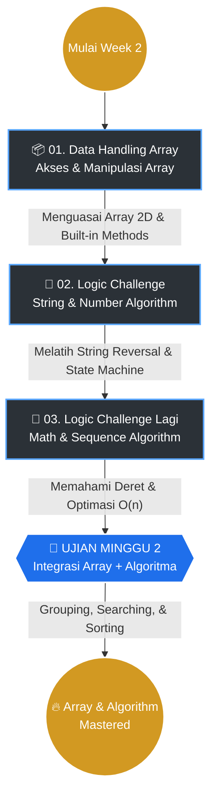

# 🚀 PHASE 0 • WEEK 2: Array Mastery & Algorithmic Thinking

> 📂 **Halaman Indeks Utama (Portal Navigasi)**
> Selamat datang di basis pembelajaran JavaScript Minggu Kedua. Jika Week 1 adalah tentang membangun fondasi (`if/else`, `loop`, `function`), maka Week 2 adalah tentang **mengorkestrasikan fondasi itu** untuk menyelesaikan masalah yang lebih kompleks. Fokus utamanya bergeser ke **manipulasi array**, **pengelompokan data**, dan **optimasi algoritma** — kemampuan inti yang membedakan *coder* dari *problem solver*.

---

## 🎯 Objektif Pembelajaran (Learning Goals)

Pada akhir minggu kedua ini, target yang ingin dicapai bukan lagi sekadar "bisa jalan", melainkan "bisa jalan **dengan baik**":
1.  **Array as Data Structure**: Menguasai array sebagai wadah data utama — dari akses indeks, iterasi, hingga transformasi multidimensi.
2.  **Algorithmic Optimization**: Mampu mengevolusi solusi dari *brute-force* O(n²) ke pendekatan optimal O(n).
3.  **Multi-Paradigm Thinking**: Melihat satu masalah dari berbagai sudut — *Imperative* (for loop), *Functional* (reduce, filter, map), dan *Hybrid*.
4.  **Debugging & Refactoring**: Membangun kebiasaan mengidentifikasi bug, memperbaiki secara bertahap, dan menulis *clean code* yang *self-documenting*.

---

## 🗺️ Peta Kurikulum & Alur Berpikir

Alur pembelajaran dirancang progresif. Setiap modul meningkatkan kompleksitas dari yang sebelumnya.

---

## 📊 Dashboard Pembelajaran

| Indikator | Metrik | Keterangan Fokus |
| :--- | :---: | :--- |
| 📁 **Total Modul** | **2 Segmen** | Terbagi atas **QUIZ** (Pembelajaran Berkelanjutan) & **UJIAN** (Evaluasi Akhir). |
| 🧩 **Jumlah Challenge** | **13 Tantangan** | 10 Quiz latihan algoritma + 3 Ujian pengujian array & grouping kompleks. |
| ⚡ **Skema Solusi** | **Multi-Version** | Didokumentasikan dari solusi buggy awal, refactoring bertahap, hingga *production-ready*. |
| 🎯 **Tingkat Kesulitan** | **Beginner ➜ Advanced** | Dari akses array 2D hingga optimasi O(n²) → O(n) dan prefix/suffix product. |

---

## 📂 Pemetaan Modul & Konteks

### 1. [📝 QUIZ — Pembelajaran Berkelanjutan](./QUIZ/)
Fase eksplorasi dan *muscle-memory*. Terbagi dalam 3 sesi kuis yang masing-masing menguji aspek berbeda dari pemrograman JavaScript.

---

#### 📁 1.1 [📦 01-Data Handling Array](./QUIZ/01-Dokumentasi-data-handling-array_penanganan-data-array/)
> **Fondasi Array:** Memahami cara JavaScript menyimpan, mengakses, dan memanipulasi data di dalam array — termasuk array multidimensi (2D).

| No | Challenge | Konteks Pembelajaran (Apa & Mengapa) | Konsep Inti |
|:---:|---|---|---|
| 01 | [Handling Data I](./QUIZ/01-Dokumentasi-data-handling-array_penanganan-data-array/01-handling-data/) | Mengakses, memetakan, & memformat data profil dari array 2D. | Array 2D, `for...of`, Array Destructuring |
| 02 | [Handling Data II](./QUIZ/01-Dokumentasi-data-handling-array_penanganan-data-array/02-handling-data2/) | Manipulasi & transformasi array menggunakan 5 built-in methods. | `splice()`, `split()`, `sort()`, `join()`, `slice()` |

---

#### 📁 1.2 [🧠 02-Logic Challenge](./QUIZ/02-Logic-Challenge/)
> **String & Number Algorithm:** Melatih pemikiran algoritmik melalui masalah manipulasi string dan angka — dari palindrome hingga penghitungan kata.

| No | Challenge | Konteks Pembelajaran (Apa & Mengapa) | Konsep Inti |
|:---:|---|---|---|
| 01 | [🔄 Palindrome Checker](./QUIZ/02-Logic-Challenge/01-Dokumentasi-palindrome-checker_pengecek-palindrome/) | Membalikkan string dan membandingkan — dari loop manual hingga `[...word].reverse().join('')`. | Reverse Iteration, Spread Operator, Method Chaining |
| 02 | [🔢 Angka Palindrome](./QUIZ/02-Logic-Challenge/02-Dokumentasi-palindrome-number-algorithm_algoritma-angka-palindrome/) | Mencari angka palindrome terdekat berikutnya menggunakan `while` loop tanpa batas pasti. | While Loop, Type Conversion (Number→String→Array), Early Return |
| 03 | [🔢 Word Counter](./QUIZ/02-Logic-Challenge/03-Dokumentasi-word-counter_penghitung-kata/) | Membangun algoritma penghitung kata dari nol — menangani spasi ganda, spasi ujung, & string kosong. | State/Flag Boolean, `.trim()`, `.split(/\s+/)`, Nested If |
| 04 | [🎯 Largest Digit Pair](./QUIZ/02-Logic-Challenge/04-Dokumentasi-largest-digit-pair_mencari-pasangan-digit-terbesar/) | Mencari pasangan 2 digit terbesar dari sebuah angka — debugging journey dari 4 versi buggy hingga sempurna. | String Indexing, `parseInt()`, `Math.max()`, Debugging Systematic |

---

#### 📁 1.3 [🧠 03-Logic Challenge Lagi](./QUIZ/03-Logic-Challenge-lagi/)
> **Math & Sequence Algorithm:** Mendalami algoritma matematika dan pengenalan pola barisan — dari rata-rata hingga deret aritmatika & geometri.

| No | Challenge | Konteks Pembelajaran (Apa & Mengapa) | Konsep Inti |
|:---:|---|---|---|
| 01 | [📊 Find Mean](./QUIZ/03-Logic-Challenge-lagi/01-Dokumentasi-find-mean_mencari-rata-rata-carimean/) | Menghitung rata-rata dengan 4 pendekatan berbeda — dari imperative hingga production-ready. | `for...of`, `reduce()`, `Math.round()`, Error Handling |
| 02 | [✖️ Unique Product](./QUIZ/03-Logic-Challenge-lagi/02-Dokumentasi-unique-multiplication-uniqueProduct_perkalian-unik/) | Menghasilkan array berisi hasil kali semua elemen kecuali elemen di posisi tersebut — optimasi O(n²) ke O(n). | Nested Loop, Division Optimization, Prefix/Suffix Product, `reduce()` |
| 03 | [📐 Deret Aritmatika](./QUIZ/03-Logic-Challenge-lagi/3-Dokumentasi-Deret-Aritamatika-isArithmeticSequence/) | Mengecek apakah array membentuk deret aritmatika (selisih konstan) — debugging bug scope variable. | Common Difference, `.every()`, Early Return, Edge Cases |
| 04 | [📐 Deret Geometri](./QUIZ/03-Logic-Challenge-lagi/4-Dokumentasi-Deret-Geometri-isGeometricSequence/) | Mengecek deret geometri (rasio konstan) — identifikasi 3 bug kritis (naming, loop boundary, edge case). | Common Ratio, Off-by-One Error, Division by Zero, Guard Clauses |

---

### 2. [🏆 UJIAN — Evaluasi & Optimasi](./UJIAN/)
Fase sintesis. Menggabungkan seluruh konsep dari modul Quiz untuk memecahkan masalah **grouping** dan **searching** yang lebih kompleks. Mengutamakan **dokumentasi evolusi solusi** untuk melihat bagaimana kode berkembang dari nested loop ke pendekatan optimal.

| No | Challenge | Objektif Tantangan | Senjata Utama (Konsep) | Varian Solusi |
|:---:|---|---|---|:---:|
| 01 | [🎯 Target Terdekat](./UJIAN/01-Dokumentasi-target-terdekat-findClosestTarget/) | Mencari jarak terdekat antara karakter `'o'` dan `'x'` dalam array. | Nested Loop → Two-Pass → Single-Pass, `lastO`/`lastX` Tracking | **5 Versi** |
| 02 | [🔢 Mengelompokkan Angka](./UJIAN/02-Dokumentasi-Mengelompokkan-Angka-groupNumbers/) | Mengelompokkan angka ke 3 kategori: genap, ganjil, kelipatan 3 (prioritas). | Modulo `%`, `if-else if`, `filter()`, `reduce()` | **3 Versi** |
| 03 | [🐾 Group Animals](./UJIAN/03-Dokumentasi-group-animals/) | Mengelompokkan nama hewan berdasarkan huruf pertama menggunakan **pure array** (tanpa Object/Map). | `charAt()`, Array `find()`/`findIndex()`, `localeCompare()` | **3 Versi** |

---

## 🎯 Matriks Sintaksis (Concept-to-Challenge Matrix)
*Butuh referensi cepat cara menggunakan metode tertentu? Gunakan matriks ini untuk langsung melompat ke file contoh penggunaannya di dunia nyata.*

| Konsep / Sintaksis JavaScript | Diimplementasikan Pada | Kategori |
|---|---|:---:|
| **Array Destructuring** | [Data Handling I](./QUIZ/01-Dokumentasi-data-handling-array_penanganan-data-array/01-handling-data/) | `QUIZ` |
| **`splice()`, `split()`, `sort()`, `join()`, `slice()`** | [Data Handling II](./QUIZ/01-Dokumentasi-data-handling-array_penanganan-data-array/02-handling-data2/) | `QUIZ` |
| **Spread `[...word]` & Reverse** | [Palindrome Checker](./QUIZ/02-Logic-Challenge/01-Dokumentasi-palindrome-checker_pengecek-palindrome/) | `QUIZ` |
| **`while` loop (batas tidak pasti)** | [Angka Palindrome](./QUIZ/02-Logic-Challenge/02-Dokumentasi-palindrome-number-algorithm_algoritma-angka-palindrome/) | `QUIZ` |
| **State/Flag & `.trim()` & `/\s+/`** | [Word Counter](./QUIZ/02-Logic-Challenge/03-Dokumentasi-word-counter_penghitung-kata/) | `QUIZ` |
| **`parseInt()` & `Math.max()`** | [Largest Digit Pair](./QUIZ/02-Logic-Challenge/04-Dokumentasi-largest-digit-pair_mencari-pasangan-digit-terbesar/) | `QUIZ` |
| **`reduce()` & `Math.round()`** | [Find Mean](./QUIZ/03-Logic-Challenge-lagi/01-Dokumentasi-find-mean_mencari-rata-rata-carimean/) | `QUIZ` |
| **Prefix/Suffix Product & O(n)** | [Unique Product](./QUIZ/03-Logic-Challenge-lagi/02-Dokumentasi-unique-multiplication-uniqueProduct_perkalian-unik/) | `QUIZ` |
| **`.every()` & Common Difference** | [Deret Aritmatika](./QUIZ/03-Logic-Challenge-lagi/3-Dokumentasi-Deret-Aritamatika-isArithmeticSequence/) | `QUIZ` |
| **Division Guard & Common Ratio** | [Deret Geometri](./QUIZ/03-Logic-Challenge-lagi/4-Dokumentasi-Deret-Geometri-isGeometricSequence/) | `QUIZ` |
| **Single-Pass Algorithm** | [Target Terdekat](./UJIAN/01-Dokumentasi-target-terdekat-findClosestTarget/) | `UJIAN` |
| **Modulo Priority (`%3` > `%2`)** | [Mengelompokkan Angka](./UJIAN/02-Dokumentasi-Mengelompokkan-Angka-groupNumbers/) | `UJIAN` |
| **Array `find()` & `localeCompare()`** | [Group Animals](./UJIAN/03-Dokumentasi-group-animals/) | `UJIAN` |

---

## 📐 Arsitektur Dokumentasi (7 Pilar Kualitas RPN)

Repositori ini bukan sekadar arsip jawaban, tetapi sebuah **buku panduan pribadi yang mendalam**. Setiap folder tantangan disusun secara absolut mengikuti **7 Pilar Kualitas RPN**:

1.  📄 **`README.md` Utama**
    Berisi penjabaran masalah, visualisasi algoritma (flowchart), blueprint arsitektur, penjelasan *step-by-step*, perbandingan evolusi solusi, konvensi penamaan (*naming guide*), dan jebakan logika (*gotchas*).
2.  📋 **`0-Cheat-Sheet-[nama-challenge].md`**
    Intisari kode siap pakai (copy-paste) yang diklasifikasikan menjadi *Best Practice* (paling efisien), *Fundamental* (paling mudah dipahami), dan *Eksperimental* (metode unik).
3.  📚 **`Dokumentasi-Lengkap.md` / `docs/`**
    Sebuah *deep dive* bedah kode baris demi baris. Dirancang untuk menanamkan pemahaman komprehensif tentang *bagaimana engine JavaScript memproses instruksi tersebut di balik layar*.

---

## 🔗 Navigasi Cepat Terintegrasi

*   ➡️ **[Masuk ke Ruang Latihan (QUIZ)](./QUIZ/)**
*   ➡️ **[Masuk ke Ruang Ujian (UJIAN)](./UJIAN/)**
*   ⬆️ **[Kembali ke PHASE-0](../)**

---
> *Didokumentasikan secara presisi untuk akselerasi belajar array mastery & algorithmic thinking. Consistency is the architecture of mastery.* 💻🔥
