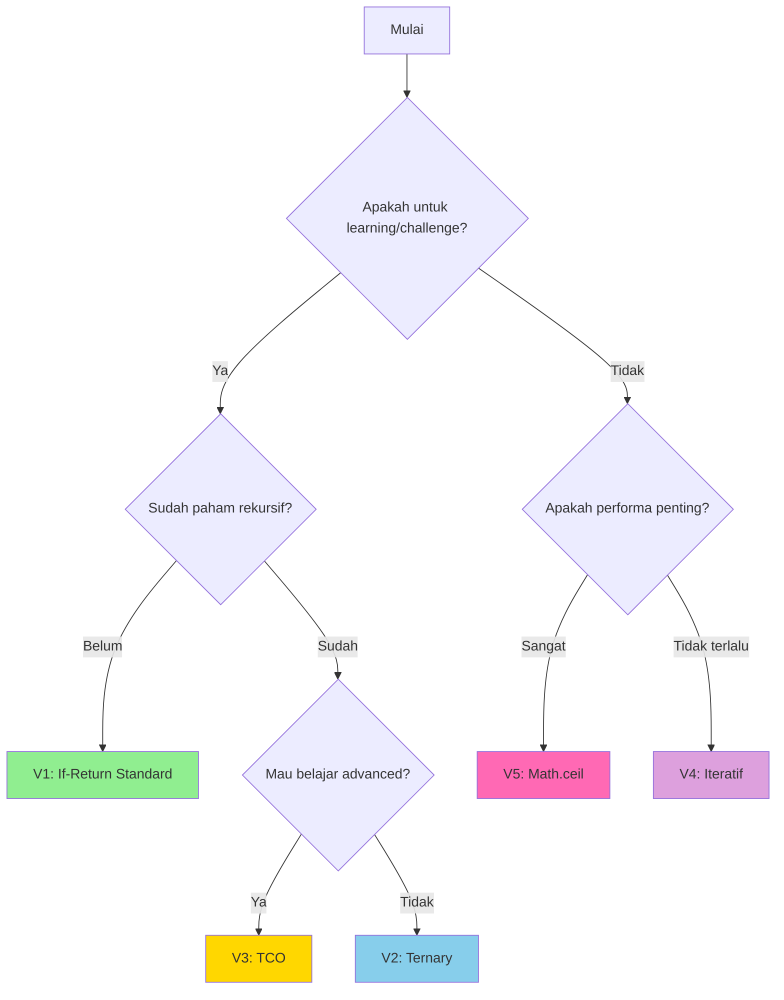

# 📦 Ringkasan Semua Versi Kode

### ✨ _Perbandingan lengkap evolusi solusi dari versi awal hingga final_

> 🎯 **Tujuan:** Memahami tradeoff setiap pendekatan dan alasan memilih versi final untuk berbagai use case

---

### 📑 Daftar Isi

| No | Bagian | Deskripsi |
|----|--------|-----------|
| 📊 | [Tabel Perbandingan](#tabel-perbandingan) | Overview semua versi |
| 1️⃣ | [Versi 1](#versi-1) | Rekursif Standard (If-Return) |
| 2️⃣ | [Versi 2](#versi-2) | Rekursif Ternary Implicit |
| 3️⃣ | [Versi 3](#versi-3) | Tail Call Optimization (TCO) |
| 4️⃣ | [Versi 4](#versi-4) | Iteratif (While Loop) |
| 5️⃣ | [Versi 5](#versi-5) | Matematika Murni (Math.ceil) |
| 🏆 | [Rekomendasi](#rekomendasi) | Versi final + alasan |

---

<a name="tabel-perbandingan"></a>
## 📊 Tabel Perbandingan

| Aspek | V1: If-Return | V2: Ternary | V3: TCO | V4: Iteratif | V5: Math | Winner |
|-------|---------------|-------------|---------|--------------|----------|--------|
| 🧠 **Kompleksitas (Time)** | O(n) | O(n) | O(n) | O(n) | O(1) | ✅ V5 |
| 💾 **Memory Usage** | O(n) stack | O(n) stack | O(1) stack* | O(1) | O(1) | ✅ V4, V5 |
| 📖 **Readability** | ⭐⭐⭐⭐⭐ | ⭐⭐⭐⭐ | ⭐⭐⭐ | ⭐⭐⭐⭐ | ⭐⭐⭐⭐⭐ | ✅ V1, V5 |
| ⚡ **Performance** | Lambat | Lambat | Lambat* | Cepat | Sangat Cepat | ✅ V5 |
| 🛡️ **Stack Safety** | ❌ Risk | ❌ Risk | ✅* Safe | ✅ Safe | ✅ Safe | ✅ V3*, V4, V5 |
| 📏 **Code Length** | 6 baris | 1 baris | 6 baris | 7 baris | 1 baris | ✅ V2, V5 |
| 🎓 **Learning Value** | ⭐⭐⭐⭐⭐ | ⭐⭐⭐⭐ | ⭐⭐⭐⭐⭐ | ⭐⭐⭐ | ⭐⭐⭐⭐ | ✅ V1, V3 |
| 🏭 **Production Ready** | ❌ No | ❌ No | ⚠️ Depends | ✅ Yes | ✅ Yes | ✅ V4, V5 |

_*Catatan: TCO hanya bekerja di engine JavaScript yang mendukung (ES6+, strict mode). Node.js dan browser modern **tidak** optimize TCO secara default._

---

<a name="versi-1"></a>
## 1️⃣ Versi 1: Rekursif Standard (If-Return)

**🎯 Strategi:** Pendekatan rekursif klasik dengan if-return statement yang eksplisit

```javascript
const makanTerusRekursif = (waktu) => {
  // Base case: berhenti jika waktu habis
  if (waktu <= 0) {
    return 0;
  }
  
  // Recursive case: hitung 1 pesanan + sisa
  return 1 + makanTerusRekursif(waktu - 15);
};
```

### ✅ Kelebihan

- **Sangat mudah dibaca** — setiap bagian terpisah jelas (base case vs recursive case)
- **Ideal untuk pembelajaran** — struktur eksplisit membantu pemahaman konsep rekursif
- **Mudah di-debug** — bisa tambahkan `console.log` di setiap bagian
- **Maintainable** — jika perlu tambah logika, mudah sisipkan kode baru

### ❌ Kekurangan

- **Stack overflow risk** — input besar (> 10,000) bisa crash
- **Memory inefficient** — setiap call menggunakan stack frame baru
- **Performance lambat** — overhead function call untuk setiap iterasi
- **Tidak production-ready** — tidak aman untuk input user arbitrary

### 📊 Use Case

```
✅ Challenge/learning environment
✅ Input terjamin kecil (< 1000)
✅ Code review/demo untuk teaching
❌ Production code
❌ User input arbitrary
```

---

<a name="versi-2"></a>
## 2️⃣ Versi 2: Rekursif Ternary Implicit

**🎯 Strategi:** Refactoring V1 menggunakan ternary operator + implicit return untuk kode lebih ringkas

```javascript
const makanTerusRekursif = (waktu) => 
  waktu <= 0 ? 0 : 1 + makanTerusRekursif(waktu - 15);
```

### ✅ Kelebihan

- **Sangat ringkas** — hanya 1 baris kode (one-liner)
- **Clean & elegant** — cocok untuk functional programming style
- **Tetap readable** — dengan spacing yang tepat, masih mudah dipahami
- **Sama performanya dengan V1** — compiler generate kode yang sama

### ❌ Kekurangan

- **Stack overflow risk** — masalah yang sama dengan V1
- **Sulit di-debug** — tidak bisa tambah `console.log` tanpa ubah struktur
- **Kurang fleksibel** — jika perlu tambah logik kompleks, harus refactor ke V1
- **Tidak production-ready** — masalah memory sama dengan V1

### 📊 Use Case

```
✅ Code golf / challenge dengan batasan baris
✅ Functional programming codebase
✅ Sudah paham rekursif (bukan untuk belajar pertama kali)
❌ Production code
❌ Butuh logging/debugging
```

### 💡 Comparison: V1 vs V2

```javascript
// V1: Eksplisit (6 baris)
const makanTerusRekursif = (waktu) => {
  if (waktu <= 0) return 0;
  return 1 + makanTerusRekursif(waktu - 15);
};

// V2: Implicit (1 baris)
const makanTerusRekursif = (waktu) => 
  waktu <= 0 ? 0 : 1 + makanTerusRekursif(waktu - 15);
```

> [!TIP]
> **Kapan pakai V2?** Jika tim sudah familiar dengan rekursif dan codebase mengikuti functional style (banyak ternary, arrow function, implicit return).

---

<a name="versi-3"></a>
## 3️⃣ Versi 3: Tail Call Optimization (TCO)

**🎯 Strategi:** Refactor rekursif agar "tail position" sehingga engine bisa optimize memory (jika didukung)

```javascript
const makanTerusRekursif = (waktu, pesanan = 0) => {
  // Base case: kembalikan hasil akumulasi
  if (waktu <= 0) {
    return pesanan;
  }
  
  // Recursive case: lempar hasil langsung (tail position)
  return makanTerusRekursif(waktu - 15, pesanan + 1);
};
```

### ✅ Kelebihan

- **Memory efficient** — O(1) space complexity (jika TCO didukung)
- **Stack safe** — tidak akan stack overflow meski input besar
- **Learning value tinggi** — mengajarkan advanced recursion pattern
- **Mathematically elegant** — pola accumulator parameter

### ❌ Kekurangan

- **TCO tidak universal** — Node.js dan most browser **TIDAK** optimize ini
- **Readability menurun** — butuh parameter tambahan (`pesanan`)
- **API kurang clean** — user harus tahu parameter kedua (atau default)
- **Overkill** — untuk problem sederhana ini, iteratif lebih baik

### 📊 TCO Support Status

| Platform | TCO Support | Note |
|----------|-------------|------|
| Safari (strict mode) | ✅ Supported | iOS/macOS only |
| Node.js | ❌ Not supported | Even in strict mode |
| Chrome/Edge | ❌ Not supported | Implemented lalu di-remove |
| Firefox | ❌ Not supported | - |

> [!WARNING]
> **Reality Check:** Meskipun TCO secara teori bagus, dalam praktik (2026) masih **tidak reliable** di most JavaScript environments.

### 💡 Comparison: V1 vs V3

```javascript
// V1: Akumulasi di return
const makanTerusRekursif = (waktu) => {
  if (waktu <= 0) return 0;
  return 1 + makanTerusRekursif(waktu - 15); // Menunggu hasil
};

// V3: Akumulasi di parameter
const makanTerusRekursif = (waktu, pesanan = 0) => {
  if (waktu <= 0) return pesanan;
  return makanTerusRekursif(waktu - 15, pesanan + 1); // Langsung lempar
};
```

**Perbedaan Kunci:**
- **V1:** Setiap level "menunggu" hasil dari level berikutnya sebelum return
- **V3:** Setiap level langsung return hasil (tidak menunggu)

### 📊 Use Case

```
✅ Learning advanced recursion
✅ Interview discussion (show you know TCO)
✅ Safari-only app (rare)
❌ General production code
❌ Cross-platform app
```

---

<a name="versi-4"></a>
## 4️⃣ Versi 4: Iteratif (While Loop)

**🎯 Strategi:** Ganti rekursif dengan loop imperatif — pendekatan tradisional yang aman

```javascript
const makanTerusIteratif = (waktu) => {
  let count = 0;
  
  while (waktu > 0) {
    count++;        // Hitung 1 pesanan
    waktu -= 15;    // Kurangi waktu
  }
  
  return count;
};
```

### ✅ Kelebihan

- **Stack safe** — tidak akan stack overflow untuk input apapun
- **Memory efficient** — O(1) space complexity
- **Production ready** — reliable di semua environment
- **Performance baik** — no overhead function call
- **Mudah dipahami** — pattern familiar untuk most programmer

### ❌ Kekurangan

- **Tidak sesuai requirement** — challenge mewajibkan rekursif
- **Mutability** — menggunakan `let` (tidak immutable)
- **Kurang elegant** — style imperatif (bukan deklaratif)

### 💡 Comparison: V1 (Rekursif) vs V4 (Iteratif)

| Aspek | Rekursif (V1) | Iteratif (V4) |
|-------|---------------|---------------|
| **Stack Usage** | O(n) | O(1) |
| **Variable Mutation** | Tidak ada | Ada (`count`, `waktu`) |
| **Elegance** | Deklaratif | Imperatif |
| **Safety** | Risk overflow | Aman |
| **Production** | ❌ | ✅ |

### 📊 Use Case

```
✅ Production code
✅ User input arbitrary
✅ Performance critical
✅ Memory constrained environment
❌ Challenge yang wajib rekursif
❌ Functional programming codebase
```

> [!IMPORTANT]
> **Rekomendasi Production:** Jika tidak ada requirement khusus untuk rekursif, **gunakan V4** untuk production code.

---

<a name="versi-5"></a>
## 5️⃣ Versi 5: Matematika Murni (Math.ceil)

**🎯 Strategi:** Eliminasi loop/rekursif sama sekali — langsung hitung dengan formula matematika

```javascript
const makanTerusMath = (waktu) => 
  waktu <= 0 ? 0 : Math.ceil(waktu / 15);
```

### ✅ Kelebihan

- **O(1) complexity** — hanya 1 operasi pembagian, tidak peduli input size
- **Super fast** — paling cepat dari semua versi
- **Memory minimal** — O(1) space
- **Production ready** — aman untuk input berapapun
- **Readable** — sekali lihat langsung paham intent
- **Mathematically pure** — functional programming ideal

### ❌ Kekurangan

- **Tidak sesuai requirement** — challenge mewajibkan rekursif
- **Kurang learning value** — tidak mengajarkan konsep rekursif
- **Domain specific** — hanya bisa untuk problem yang punya formula matematik

### 💡 Formula Breakdown

```javascript
Jumlah pesanan = ⌈waktu / 15⌉

Contoh:
waktu = 45  → ⌈45 / 15⌉ = ⌈3⌉ = 3 ✅
waktu = 50  → ⌈50 / 15⌉ = ⌈3.33⌉ = 4 ✅
waktu = 10  → ⌈10 / 15⌉ = ⌈0.67⌉ = 1 ✅
waktu = 0   → Guard clause → 0 ✅
```

**Mengapa `Math.ceil` (bukan `Math.floor` atau `Math.round`)?**

```javascript
// Contoh: waktu = 50 menit
50 / 15 = 3.33

Math.floor(3.33) = 3  ❌ (seharusnya 4, karena sisa 5 menit masih bisa memesan)
Math.round(3.33) = 3  ❌ (sama, salah)
Math.ceil(3.33) = 4   ✅ (benar! sisa 5 menit tetap dihitung 1 pesanan)
```

### 📊 Performance Comparison

| Versi | Input: 1000 | Input: 10000 | Input: 100000 |
|-------|-------------|--------------|---------------|
| V1-V3 (Rekursif) | ~0.1ms | Stack overflow 💥 | Stack overflow 💥 |
| V4 (Iteratif) | ~0.5ms | ~5ms | ~50ms |
| V5 (Math) | ~0.001ms | ~0.001ms | ~0.001ms |

> [!TIP]
> **Winner:** V5 menang telak dalam performa. Bahkan untuk input 100,000, eksekusi tetap instant.

### 📊 Use Case

```
✅ Production code (jika boleh non-rekursif)
✅ Performance critical
✅ API/microservice dengan high throughput
✅ Mobile app (hemat battery)
❌ Challenge yang wajib rekursif
❌ Learning rekursif
```

---

<a name="rekomendasi"></a>
## 🏆 Rekomendasi

### Pilih Versi Berdasarkan Context



### Tabel Keputusan

| Skenario | Rekomendasi | Alasan |
|----------|-------------|--------|
| **Challenge rekursif** | V1 atau V2 | Sesuai requirement, mudah dipahami |
| **Learning rekursif** | V1 → V2 → V3 | Progresif dari basic ke advanced |
| **Production (boleh non-rekursif)** | V5 | Paling cepat, aman, readable |
| **Production (harus loop)** | V4 | Aman, predictable, reliable |
| **Interview coding** | V1 + jelaskan V5 | Show understanding + optimization |
| **Code golf** | V2 atau V5 | Paling pendek |
| **Functional programming** | V5 | Pure function, immutable |

### Rekomendasi Final per Use Case

#### 🎓 Untuk Learning (Gunakan Bertahap)

```javascript
// 1. Mulai dengan V1 (pahami konsep)
const v1 = (waktu) => {
  if (waktu <= 0) return 0;
  return 1 + makanTerusRekursif(waktu - 15);
};

// 2. Refactor ke V2 (clean code)
const v2 = (waktu) => 
  waktu <= 0 ? 0 : 1 + makanTerusRekursif(waktu - 15);

// 3. Explore V3 (advanced pattern)
const v3 = (waktu, pesanan = 0) => {
  if (waktu <= 0) return pesanan;
  return makanTerusRekursif(waktu - 15, pesanan + 1);
};
```

#### 🏭 Untuk Production

```javascript
// Best choice: V5 (Matematika Murni)
const makanTerus = (waktu) => {
  // Guard clause untuk input validation
  if (typeof waktu !== 'number' || isNaN(waktu)) {
    throw new TypeError('Parameter waktu harus berupa number');
  }
  
  // Formula matematika O(1)
  return waktu <= 0 ? 0 : Math.ceil(waktu / 15);
};
```

#### 🎤 Untuk Interview

```javascript
// Jawab dengan V1, lalu diskusikan optimasi
const makanTerusRekursif = (waktu) => {
  if (waktu <= 0) return 0;
  return 1 + makanTerusRekursif(waktu - 15);
};

// Lalu sebutkan:
// "Untuk production, saya akan gunakan Math.ceil(waktu / 15)
//  karena O(1) complexity dan no stack overflow risk"
```

---

## 🎯 Kesimpulan

### Key Takeaways

| Insight | Penjelasan |
|---------|------------|
| **Tidak ada "best" universal** | Pilihan bergantung context (learning vs production) |
| **Rekursif = elegant, bukan efficient** | Bagus untuk konsep, kurang ideal untuk performa |
| **Math > Iteration > Recursion** | Untuk production, prioritaskan formula matematika |
| **TCO masih teoretis** | Jangan andalkan TCO di JavaScript (2026) |
| **Readability matters** | V1 dan V5 paling mudah dipahami |

### Final Verdict

```
🥇 Best for Learning:    V1 (If-Return Standard)
🥇 Best for Production:  V5 (Math.ceil)
🥇 Best for Interview:   V1 + explain V5
🥇 Best for Code Golf:   V2 atau V5
🥇 Best for Teaching:    V1 → V2 → V3 (progression)
```

> [!IMPORTANT]
> **Takeaway Utama:** Rekursif adalah **tool untuk belajar konsep**, bukan **tool untuk production**. Setelah paham konsep rekursif, selalu pertimbangkan alternatif yang lebih efisien (iteratif atau matematika) untuk code nyata.

---

### 🧭 Navigasi

| Link | Deskripsi |
|------|-----------|
| [⬆️ Kembali ke README](../README.md) | Halaman utama dokumentasi |
| [📊 Analisis Pola](./01-analisis-pola.md) | Mulai dari awal: Tabel breakdown |
| [🗺️ Blueprint & Naming](./02-blueprint-kode.md) | Kerangka kode + algoritma |
| [🔨 Implementasi Bertahap](./03-implementasi-bertahap.md) | Step-by-step coding |
| [⚠️ Gotchas](./04-gotchas.md) | Jebakan umum |

---

📅 **Terakhir diupdate:** 7 Juni 2026
